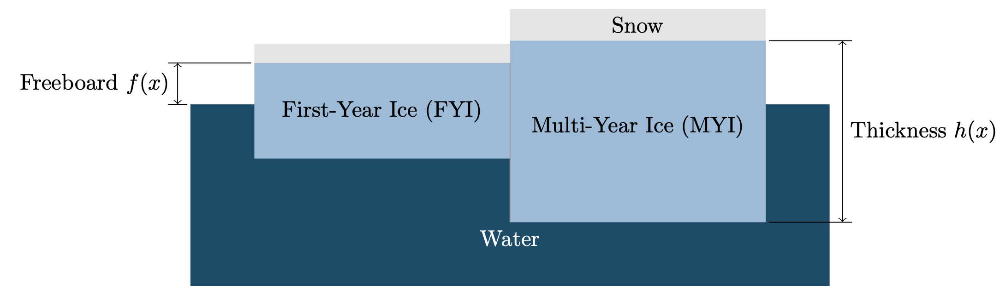

.. SIMDA Challenges documentation master file, created by
   sphinx-quickstart on Thu Jun 16 09:45:56 2022.
   You can adapt this file completely to your liking, but it should at least
   contain the root `toctree` directive.

Sea Ice Characterization Challenge Problems 
=============================================

Variables that arise in sea ice dynamics can be *discontinuous* in space and time,
are almost always *sparsely* observed, and often only indirectly to observable 
quantities, resulting in significant *uncertainty*.   Sea ice therefore provides a
natural application space for us to develop new mathematical techniques for 
characterizing "DSU" variables.   This package aims to formulation several prototypical
inverse problems related to sea ice dynamics and navigation.  These problems focus primarily
on characterizing sea ice thickness and provide a sequency with increasing in complexity
and realism.  

.. panels::
    :img-top-cls: pl-4 pr-4

    ---
    
    **Problem 1: Static Estimation**
    ^^^^^^^^^^^^^^^^^^^^^

    Static estimation of ice thickness.

    .. link-button:: source/descriptions/problem1.html
        :type: url
        :text: Learn more
        :classes: btn-secondary stretched-link

    ---
    
    **Problem 2: Lagrangian Mapping**
    ^^^^^^^^^^^^^^^^^^^^

    Ice thickness estimation in moving Lagrangian reference frame.

    .. link-button:: source/descriptions/problem2.html
        :type: url
        :text: Learn more
        :classes: btn-secondary stretched-link

    ---
    
    **Problem 3: Data Assimilation**
    ^^^^^^^^^^^^^^^^^^^^^^^^

    Sequential inference and data assimilation.

    .. link-button:: source/descriptions/problem3.html
        :type: url
        :text: Learn more
        :classes: btn-secondary stretched-link
        

Contents 
-------------

.. toctree::
   :maxdepth: 2

   source/descriptions/index.rst
   source/implementations/index.rst 
