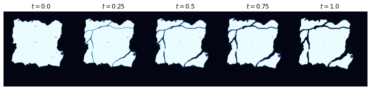

.. _problem2:

==========================================
Problem 2: Lagrangian Observation Mapping
==========================================

------------------------------------------------------
Problem Statement
------------------------------------------------------

The CryoSat-2 and ICESat-2 satellites are our primary sources for remotely acquired ice thickness data. While the former has wide coverage, its accuracy is low. Conversely, ICESat-2 has high accuracy but a low footprint. The goal of data fusion is to achieve the best of both worlds: We want high coverage and high accuracy. However, in order to combine these data sets, we must first solve a preliminary problem.  

Satellite observations are taken at different times, and the ice topology (i.e., its spatial configuration on the surface of the ocean) will have changed during the interim through a combination of advection as well as various mechanical deformations, such as splitting and ridging. If we ignore the effects of ridging, then, over small time scales, thermodynamic effects will be negligible, and we can assume that the thickness at any particular point on the ice floe or ice sheet in question remains constant. 

Considering the movement of particular points of ice gives us a Lagrangian, or particle-based, coordinate system, as opposed to an Eulerian coordinate system, where we measure changes in ice position relative to a fixed background grid. Under the Lagrangian perspective, we can summarize our assumption from above by saying: Thickness remains constant along flow lines. Thus, if we can register the data---that is, if we can undo the effects of the various transformations to obtain a static view of the ice topology---we will have a much larger data set to work with.

More precisely, our problem is this: Let :math:`\Omega\subseteq\mathbb{R}^2` be a domain, and let :math:`\Gamma_t\subseteq\Omega` be an open subset representing the ice topology at time :math:`t`. Further, let :math:`H:\mathbb{R}_{+}\times \Gamma_t\to\mathbb{R}` be a (random) field denoting ice thickness at time :math:`t` and location :math:`(x, y)`. Our goal is to register data of the form :math:`\{H(t_i,x_i)\}_{i=1}^N` to obtain a non-time-varying ice thickness field :math:`\tilde{H}:\Gamma\to\mathbb{R}` defined on a common reference configuration :math:`\Gamma\subseteq \Omega` of the ice.  

For simplicity, normalize the time interval to :math:`[0, 1]`, and assume that thickness observations are taken only at initial and final times. That is, assume we have :math:`N` thickness measurements :math:`\{H(0, x_i)\}_{i=1}^N` at time :math:`t=0`, and :math:`M` thickness measurements :math:`\{H(1,y_j)\}_{j=1}^M` at time :math:`t=1`. In order to chain together sequences of observations, we will typically take :math:`\Gamma_1` to be the reference configuration. Thus, we seek a diffeomorphism, or merely a measure-preserving map, :math:`T:\Gamma_0\to\Gamma_1`. Given such :math:`T`, we set

.. math:: 

    \begin{split}
        \tilde{H}(T(x_i))&=H(0, x_i)\hspace{4mm}\text{for } i = 1,\dots, N,\text{ and }\\
        \tilde{H}(y_j)&=H(1, y_j)\hspace{4mm} \text{for } j = 1,\dots, M.
    \end{split}

Using this data, we can then apply further inference, approximation, or model-based methods (see problems 1 and 2) to define a registered ice thickness field :math:`\tilde{H}:\Gamma\to\mathbb{R}` over the entire reference configuration :math:`\Gamma=\Gamma_1`.

------------------------------------------------------
Registration via Optimal Transport
------------------------------------------------------

We now describe our method for obtaining the map :math:`T` used to register the data. As shown by Parno et al. [Parno2019]_, optimal transport methods are well-suited for solving sea ice motion estimation and registration problems, and it is this methodology that we follow here. There are, of course, other methods one can consider, such as image registration in the large deformation diffeomorphic metric matching (LDDMM) framework (see, e.g., [Beg2005]_), or optical flow algorithms (e.g., [Petrou2016]_), to name only two. Such methods, however, can struggle with the large displacements and topological changes (namely splitting) that are common in sea ice scenarios.

We refer to [Parno2019]_ for complete details of the method. Briefly, the idea is this: Suppose we have scalar-valued source and target images :math:`p` and :math:`q`, both of dimension :math:`N=n\times m`. After vectorizing and normalizing the images, we can view :math:`p` and :math:`q` as probability mass functions on :math:`\{1, \dots, N\}`. A transport plan, or coupling, from :math:`p` to :math:`q` is a joint distribution with marginals given by :math:`p` and :math:`q`, and in the discrete setting, a coupling is given by an :math:`N\times N` matrix :math:`\gamma` whose rows and columns sum to :math:`p` and :math:`q`, respectively. That is, 

.. math:: 

    \sum_i\gamma_{ij} = p_i, \hspace{4mm}\text{and } \sum_j\gamma_{ij} = q_j,

where :math:`p_i` denotes the :math:`i`-th entry of :math:`p`, and similarly for :math:`q`. To select the plan that rearranges the source mass into the target mass most efficiently, we define a ground cost :math:`c_{ij}` that gives the cost of moving a unit of mass from pixel :math:`i` to pixel :math:`j`. Typically, :math:`c_{ij}` is taken as the squared Euclidean distance between the pixel centers. Then, the cost of a transport plan is given by :math:`\sum_{ij}c_{ij}\gamma_{ij}`, and the optimal transport problem is to find the transport plan :math:`\gamma` with minimum cost. 

Extensive effort has gone into solving optimal transport problems efficiently; see, e.g., [Peyre2019]_. For numerical experiments, we use the solver developed by Zhou and Parno [Zhou2022]_, which can be used for more general multimarginal optimal transport problems. Given the optimal coupling :math:`\sigma`, we obtain a transport map :math:`T` via the barycentric projection map, as defined in [Peyre2019]_; see [Parno2019]_ for a quick summary of details. 

We can see the results of this method in the synthetic example shown below: 

The point in the lower right-hand corner corresponds to a location where we have thickness data available. As can be seen, the transport map accurately tracks the motion of this point as the ice floe undergoes various changes. As such, we can map this and other measurements from the source image into the target image to obtain a registered data set suitable for further processing. 

------------------------------------------------------
References
------------------------------------------------------

.. [Beg2005] Beg, M. F., Miller, M. I., Trouvé, A., & Younes, L. (2005). Computing large deformation metric mappings via geodesic flows of diffeomorphisms. International journal of computer vision, 61(2), 139-157.

.. [Parno2019] Parno, M. D., West, B. A., Song, A. J., Hodgdon, T. S., & O'Connor, D. T. (2019). Remote measurement of sea ice dynamics with regularized optimal transport. Geophysical Research Letters, 46(10), 5341-5350.

.. [Petrou2016] Petrou, Z. I., & Tian, Y. (2016). High-resolution sea ice motion estimation with optical flow using satellite spectroradiometer data. IEEE Transactions on Geoscience and Remote Sensing, 55(3), 1339-1350.

.. [Peyre2019] Peyré, G., & Cuturi, M. (2019). Computational optimal transport: With applications to data science. Foundations and Trends® in Machine Learning, 11(5-6), 355-607.

.. [Zhou2022] Zhou, B., & Parno, M. (2022). Efficient and Exact Multimarginal Optimal Transport with Pairwise Costs. arXiv preprint arXiv:2208.03025.